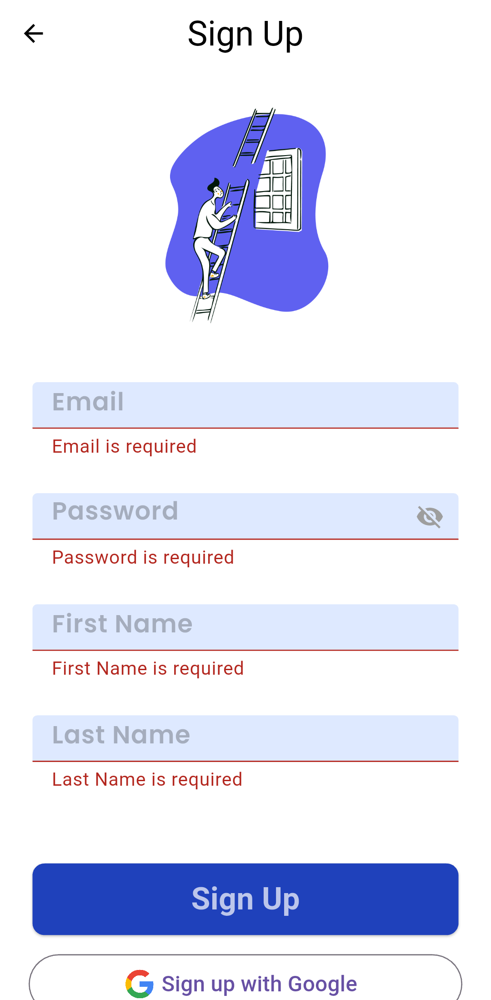
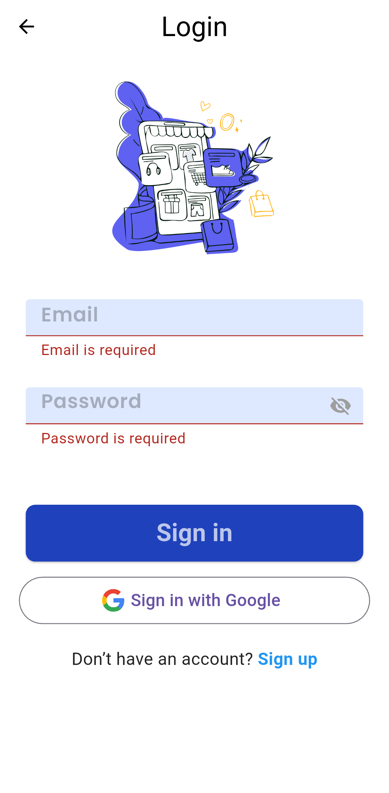
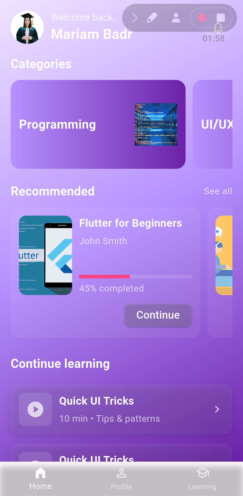
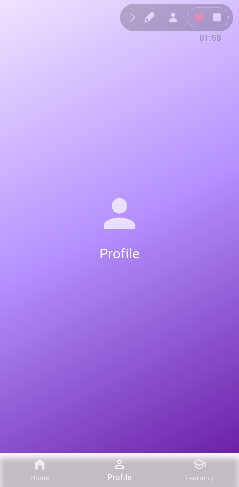
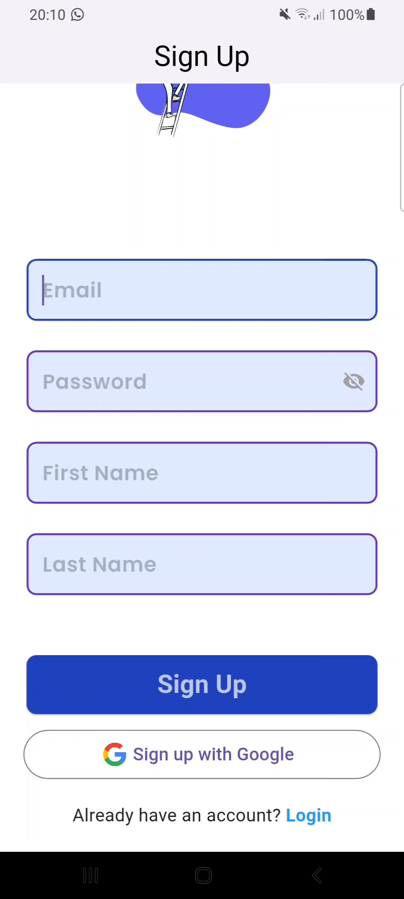
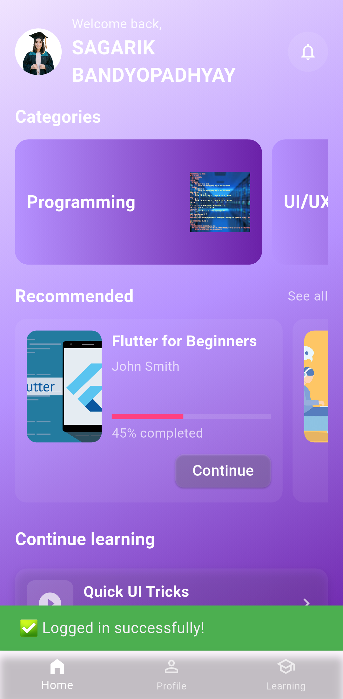

Learnio – Online Learning App

Learnio is a Flutter-based mobile application designed for online learning and course progress management. It provides an interactive platform where learners can enroll in courses, study through structured modules, and track their academic progress. Administrators can create, edit, and manage courses, monitor performance, and deliver timely feedback — all within a unified environment.

---

🚀 Main Features
- 🔐 Secure Login: Role-based access for learners and admins
- 🎓 Course Management: Add, edit, and organize courses with ease
- 🎥 Interactive Learning: Access video lessons, documents, and other learning materials
- 📈 Progress Tracking: View learner performance through analytics and milestones
- 🔔 Notifications & Feedback: Real-time updates, reminders, and instructor feedback

---

This README has been expanded to include the project structure and recent implementation highlights.

Checklist of recent work included in this build:
- Enhanced UI for Home, Login & Sign Up screens
- Integrated API with Login & Sign Up + added error handling
- Built Home screen & connected JSON data
- Passed data to Categories & Courses screens

---

Project structure (top-level)

- android/                - Android native project files and Gradle wrappers
  - app/                  - Android app module
- ios/                    - iOS native project files
- lib/                    - Main Flutter source code (primary area of development)
  - main.dart             - App entrypoint
  - app_screens/          - Screens for the app (home, login, onboarding, sign up, splash)
    - home_screen.dart
    - login/
    - onboarding_Screens/
    - sign_up/
    - splash/
  - models/               - Data model classes (e.g. `category.dart`)
  - reusable_widgets/     - Shared UI components (custom input fields, buttons, etc.)
  - utils/                - Colors, assets, routes, styles helpers
- assets/                 - Images and static assets
  - categories.json       - Mock JSON data for categories (used by Home screen)
  - courses.json          - (if present) mock courses data
  - images/               - App images and icons
- build/                  - Build output (generated - not committed)
- ios/, android/, web/, windows/ - Platform-specific build/run targets
- test/                   - Widget and unit tests
- pubspec.yaml            - Dart/Flutter package manifest
- README.md               - This file

Note: The above mirrors the workspace at the time of writing; small paths/files may vary across branches.

---

Details: Implemented features (concise)

1) Enhanced UI for Home, Login & Sign Up screens
- Modern, minimal, futuristic design language with purple gradient tones (light violet to deep violet).
- Clean app header, rounded cards, soft shadows, and comfortable spacing for readability.
- Home screen is fully scrollable and responsive across device sizes.

2) Integrated API with Login & Sign Up + error handling
- Authentication endpoints wired to the UI flows for Login and Sign Up.
- Input validation, network error handling, and user-facing error messages implemented.
- Secure token handling and local persistence (where appropriate in this build).

3) Built Home screen & connected JSON data
- Home tab includes a top bar showing the logged-in user name, static profile picture, and a notification bell icon on the right.
- Horizontally scrollable category cards consume the mock JSON from `assets/categories.json`.
- Featured/Recommended courses section with visually appealing cards; cards are tappable and navigate to course details.

4) Passed data to Categories & Courses screens
- Category selections pass the selected category payload to the Categories screen.
- Course selections pass course data to a Course Details/Course Player screen.

---

Mock data example (used for UI development)

assets/categories.json

```json
[
  { "id": 1, "title": "Flutter Development", "image": "flutter.png" },
  { "id": 2, "title": "Web Design", "image": "web.png" },
  { "id": 3, "title": "AI & Machine Learning", "image": "ai.png" },
  { "id": 4, "title": "Data Analysis", "image": "data.png" }
]
```

---

How to run (local)

1) Ensure Flutter is installed and configured: https://flutter.dev/docs/get-started/install
2) From the project root, fetch packages:

    flutter pub get

3) Run the app (choose device or emulator):

    flutter run

Notes:
- The app uses assets declared in `pubspec.yaml`; if you add new assets, run `flutter pub get` and rebuild.
- If you update platform files, use the normal Flutter platform build commands (e.g., `flutter build apk`).

---

Screenshots

The following gallery shows UI screenshots (thumbnails link to full-size images). Images are placed in rows of three for a cleaner layout.

<table>
  <tr>
    <td align="center">
      <a href="assets/images/Screenshot_20251027-204451.png"></a>
      <div style="font-size:0.9em; margin-top:6px">Home / Dashboard</div>
    </td>
    <td align="center">
      <a href="assets/images/Screenshot_20251027-204501.png"></a>
      <div style="font-size:0.9em; margin-top:6px">Home (alternate)</div>
    </td>
    <td align="center">
      <a href="assets/images/Screenshot_20251027-205822.png"></a>
      <div style="font-size:0.9em; margin-top:6px">Course list / Categories</div>
    </td>
  </tr>
  <tr>
    <td align="center">
      <a href="assets/images/Screenshot_20251027-205825.png"></a>
      <div style="font-size:0.9em; margin-top:6px">Course detail / Player</div>
    </td>
    <td align="center">
      <a href="assets/images/Screenshot_20251027-205832.png"></a>
      <div style="font-size:0.9em; margin-top:6px">Profile / Settings</div>
    </td>
    <td align="center">
      <a href="assets/images/Screenshot_20251027-210101_Gallery.png"></a>
      <div style="font-size:0.9em; margin-top:6px">Gallery / Onboarding</div>
    </td>
  </tr>
  <tr>
    <td align="center">
      <a href="assets/images/Screenshot_20251027-212258.png"></a>
      <div style="font-size:0.9em; margin-top:6px">Additional screen</div>
    </td>
    <td align="center">
      <a href="assets/images/login.png"></a>
      <div style="font-size:0.9em; margin-top:6px">Login screen</div>
    </td>
    <td align="center">
      <a href="assets/images/sign_up.png"></a>
      <div style="font-size:0.9em; margin-top:6px">Sign Up screen</div>
    </td>
  </tr>
</table>

---

Developer notes & next steps

- Tests: Add widget tests for Home, Login, and Sign Up flows. A minimal `test/widget_test.dart` exists as a starting point.
- Accessibility: Review color contrast for purple gradient backgrounds and ensure tappable areas meet size recommendations.
- API: Add retry/backoff and more granular error states for production readiness.
- Analytics & Logging: Integrate analytics and structured logs for usage insights and error diagnosis.

---

Credits

- Built with Flutter and Dart
- Design inspiration: Figma
