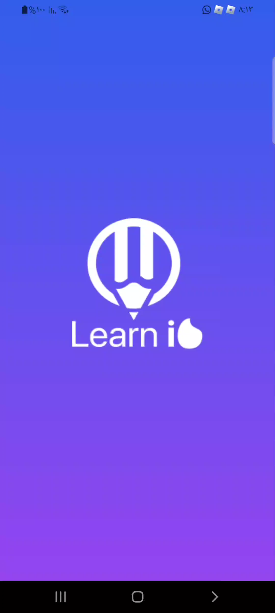
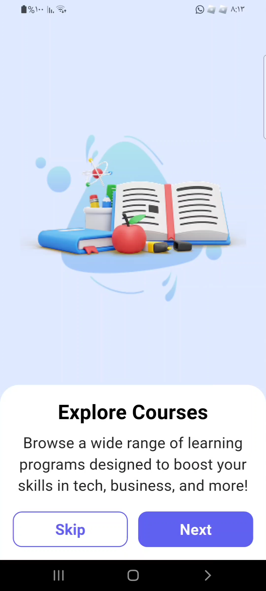
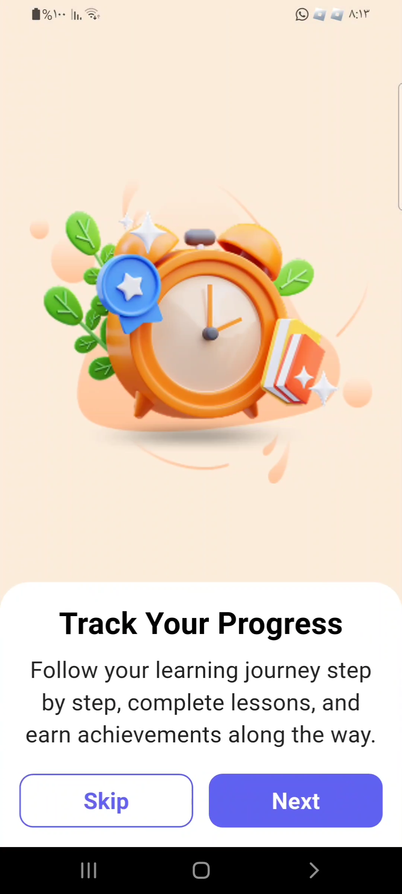
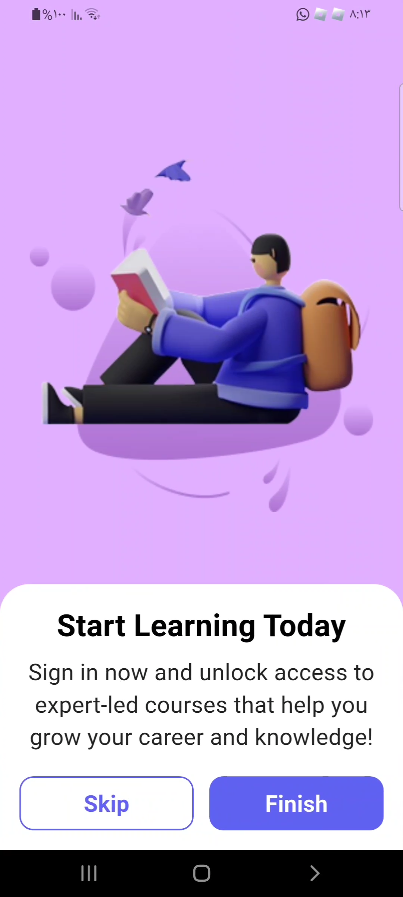
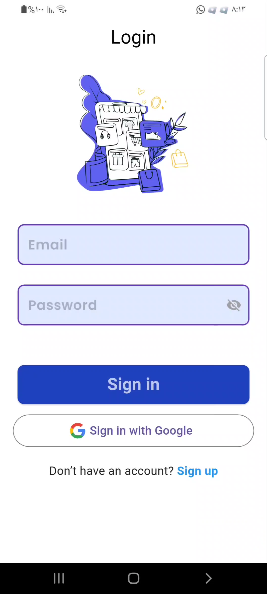
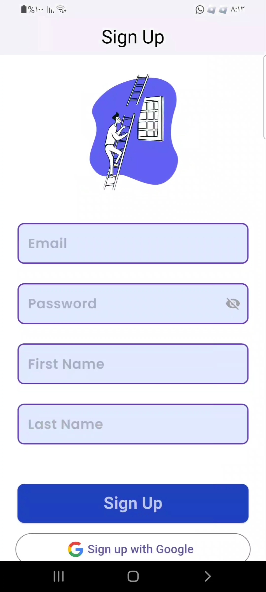
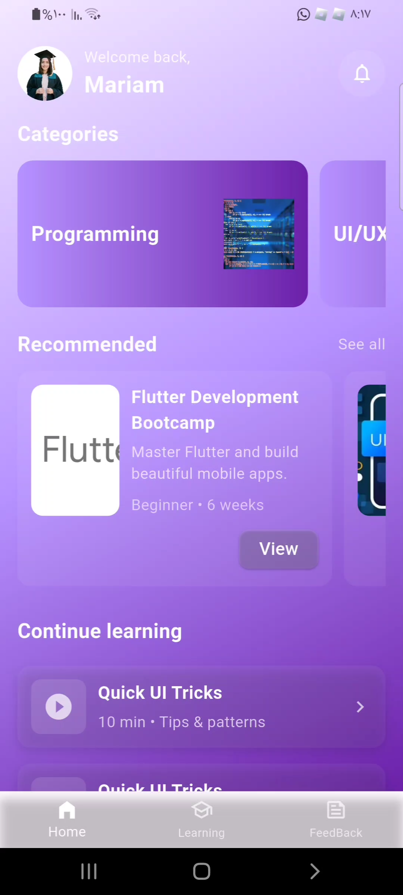
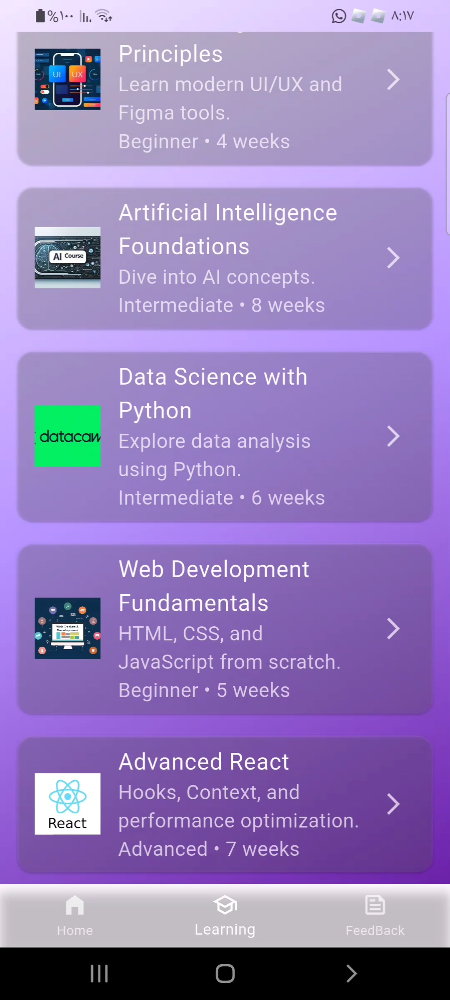
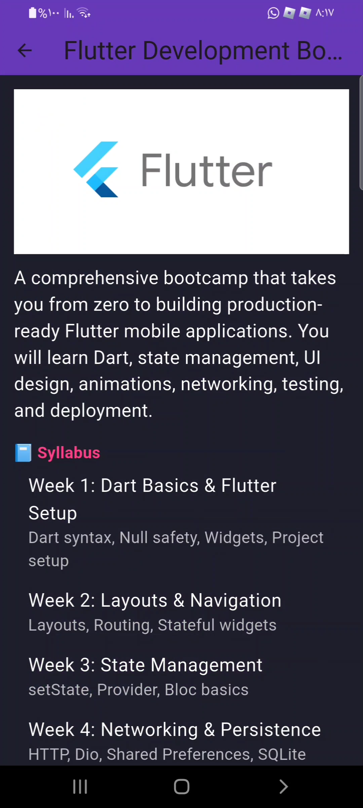

Learnio – Online Learning App

Learnio is a Flutter-based mobile application designed for online learning and course progress management. It provides an interactive platform where learners can enroll in courses, study through structured modules, and track their academic progress. Administrators can create, edit, and manage courses, monitor performance, and deliver timely feedback — all within a unified environment.


✅ Features delivered
- Login Screen — Email & Password fields, Login button, input validation, and a sample API call (mock/sample endpoint). On successful login the app navigates to the Home screen. (Implemented: ✅)
- Home Screen — Displays learner name, profile avatar, a Recommended Courses section, and a prominent button that navigates to the Learning screen. Consistent branding (logo, colors, typography) is used across the app. (Implemented: ✅)
- Learning (Programs) Screen — Fetches and displays courses from a local JSON file (`assets/courses.json`). Courses are shown in a scrollable list/grid with thumbnail, title, short description, and duration. Tapping a course opens the Course Details screen. (Implemented: ✅)
- Course Details Screen — Receives the selected course object and displays full details: title, full description, syllabus/resources, instructor, duration, price (if present), and course image. Navigation back to the Learning or Home screens is supported. (Implemented: ✅)
- Feedback Screen — A feedback form with Name, Email, and Message fields. Validation is performed and on submit the app shows a success message and either prints/saves the feedback (mock submission/local persistence). (Implemented: ✅)
- Navigation — Smooth, predictable navigation is implemented using named routes (Navigator.pushNamed / pushReplacementNamed). All major screens are accessible via named routes for easier testing and deep-linking. (Implemented: ✅)
- Shared Theme & Branding — A unified app theme (colors, typography), app logo, and consistent styling are applied across screens via shared theme and utility files. (Implemented: ✅)
- Data Integration — Courses are loaded from `assets/courses.json` (local asset). Course objects are passed between screens via the navigation arguments; form submissions are handled and logged or forwarded to a sample endpoint. (Implemented: ✅)
- App functionality — The app is functional (not only UI): network/mock API calls, local JSON loading, navigation, and forms work end-to-end in this build. (Implemented: ✅)


Checklist of recent work included in this build:
- Enhanced UI for Home, Login & Sign Up screens
- Integrated API with Login & Sign Up + added error handling
- Built Home screen & connected JSON data
- Passed data to Categories & Courses screens

---

Project structure (top-level)

- android/                - Android native project files and Gradle wrappers
  - app/                  - Android app module
- ios/                    - iOS native project files
- lib/                    - Main Flutter source code (primary area of development)
  - main.dart             - App entrypoint
  - app_screens/          - Screens for the app (home, login, onboarding, sign up, splash)
    - home_screen.dart
    - login/
    - onboarding_Screens/
    - sign_up/
    - splash/
  - models/               - Data model classes (e.g. `category.dart`)
  - reusable_widgets/     - Shared UI components (custom input fields, buttons, etc.)
  - utils/                - Colors, assets, routes, styles helpers
- assets/                 - Images and static assets
  - categories.json       - Mock JSON data for categories (used by Home screen)
  - courses.json          - (if present) mock courses data
  - images/               - App images and icons
- build/                  - Build output (generated - not committed)
- ios/, android/, web/, windows/ - Platform-specific build/run targets
- test/                   - Widget and unit tests
- pubspec.yaml            - Dart/Flutter package manifest
- README.md               - This file


---
Mock data example (used for UI development)

assets/categories.json

```json
[
  { "id": 1, "title": "Flutter Development", "image": "flutter.png" },
  { "id": 2, "title": "Web Design", "image": "web.png" },
  { "id": 3, "title": "AI & Machine Learning", "image": "ai.png" },
  { "id": 4, "title": "Data Analysis", "image": "data.png" }
]
```

---

How to run (local)

1) Ensure Flutter is installed and configured: https://flutter.dev/docs/get-started/install
2) From the project root, fetch packages:

    flutter pub get

3) Run the app (choose device or emulator):

    flutter run

Notes:
- The app uses assets declared in `pubspec.yaml`; if you add new assets, run `flutter pub get` and rebuild.
- If you update platform files, use the normal Flutter platform build commands (e.g., `flutter build apk`).

---

Screenshots

The following gallery shows UI screenshots (thumbnails link to full-size images). Images are placed in rows of three for a cleaner layout.

<table>
  <tr>
    <td style="text-align:center">
      <a href="assets/images/Screenshot_٢٠٢٥١١٠٣-٢٠٢٧٥١_Gallery.png"></a>
      <div style="font-size:0.9em; margin-top:6px">Home / Dashboard</div>
    </td>
    <td style="text-align:center">
      <a href="assets/images/Screenshot_٢٠٢٥١١٠٣-٢٠٢٧٥٤_Gallery.png"></a>
      <div style="font-size:0.9em; margin-top:6px">Home (alternate)</div>
    </td>
    <td style="text-align:center">
      <a href="assets/images/Screenshot_٢٠٢٥١١٠٣-٢٠٢٨٢٨_Gallery.png"></a>
      <div style="font-size:0.9em; margin-top:6px">Course list / Categories</div>
    </td>
  </tr>
  <tr>
    <td style="text-align:center">
      <a href="assets/images/Screenshot_٢٠٢٥١١٠٣-٢٠٢٨٤٠_Gallery.png"></a>
      <div style="font-size:0.9em; margin-top:6px">Course detail / Player</div>
    </td>
    <td style="text-align:center">
      <a href="assets/images/Screenshot_٢٠٢٥١١٠٣-٢٠٢٨٤٥_Gallery.png"></a>
      <div style="font-size:0.9em; margin-top:6px">Profile / Settings</div>
    </td>
    <td style="text-align:center">
      <a href="assets/images/Screenshot_٢٠٢٥١١٠٣-٢٠٢٨٥٧_Gallery.png"></a>
      <div style="font-size:0.9em; margin-top:6px">Gallery / Onboarding</div>
    </td>
  </tr>
  <tr>
    <td style="text-align:center">
      <a href="assets/images/Screenshot_٢٠٢٥١١٠٣-٢٠٢٩١١_Gallery.png"></a>
      <div style="font-size:0.9em; margin-top:6px">Additional screen</div>
    </td>
    <td style="text-align:center">
      <a href="assets/images/Screenshot_٢٠٢٥١١٠٣-٢٠٢٩٢٢_Gallery.png"></a>
      <div style="font-size:0.9em; margin-top:6px">Login screen</div>
    </td>
    <td style="text-align:center">
      <a href="assets/images/Screenshot_٢٠٢٥١١٠٣-٢٠٢٩٣٣_Gallery.png"></a>
      <div style="font-size:0.9em; margin-top:6px">Sign Up screen</div>
    </td>
  </tr>
</table>

---

```bash
flutter pub add video_player
```

```dart
import 'package:flutter/material.dart';
import 'package:video_player/video_player.dart';

class LearnioDemoVideo extends StatefulWidget {
  @override
  _LearnioDemoVideoState createState() => _LearnioDemoVideoState();
}

class _LearnioDemoVideoState extends State<LearnioDemoVideo> {
  late VideoPlayerController _controller;

  @override
  void initState() {
    super.initState();
    _controller = VideoPlayerController.asset('assets/images/learnio_final_app.mp4')
      ..initialize().then((_) {
        setState(() {});
      });
  }

  @override
  void dispose() {
    _controller.dispose();
    super.dispose();
  }

  @override
  Widget build(BuildContext context) {
    if (!_controller.value.isInitialized) return const SizedBox.shrink();
    return Column(
      children: [
        AspectRatio(
          aspectRatio: _controller.value.aspectRatio,
          child: VideoPlayer(_controller),
        ),
        Row(
          mainAxisAlignment: MainAxisAlignment.center,
          children: [
            IconButton(
              icon: Icon(
                _controller.value.isPlaying ? Icons.pause : Icons.play_arrow,
              ),
              onPressed: () => setState(() {
                _controller.value.isPlaying ? _controller.pause() : _controller.play();
              }),
            ),
          ],
        ),
      ],
    );
  }
}
```